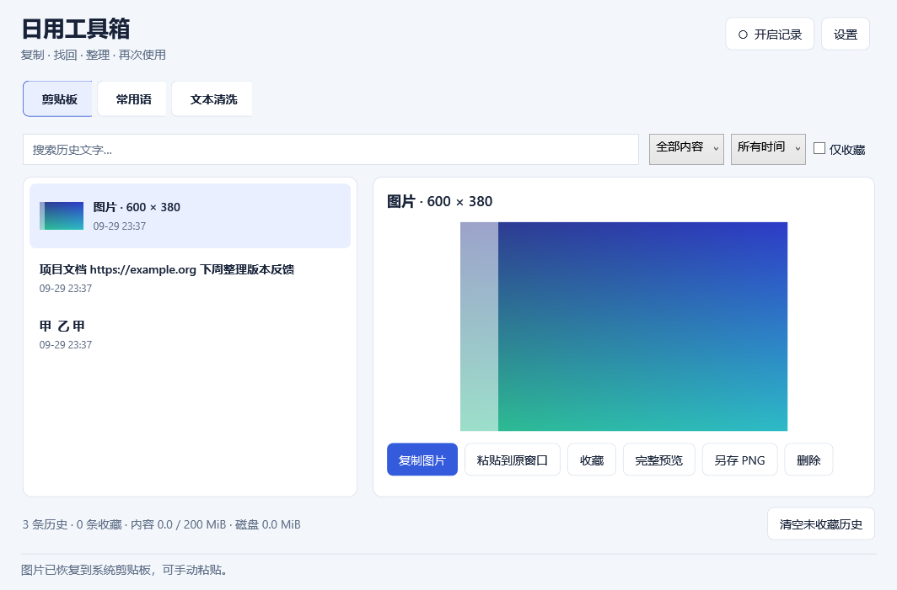

# 日用工具箱 / Everyday Toolkit

[English](README.md) | 中文 · [使用说明](docs/user-guide.md) · [v0.1.0 版本说明](docs/releases/v0.1.0.md)

日用工具箱是一款面向 Windows 11 x64 的开源办公应用，提供文字与静态图片剪贴板历史、收藏、常用语和文本清洗，用中文快捷面板连接复制、找回、整理与再次使用。内容在本机处理，核心功能离线可用，无需账号。

Everyday Toolkit is an open-source Windows 11 x64 productivity app with text and static-image clipboard history, favorites, reusable text snippets and text cleanup, using a Chinese quick panel and local storage.

快捷面板提供适应主题的较大控件与可见键盘焦点；窗口宽度小于 920 逻辑像素时，历史、常用语和文本清洗的预览上下排列，方便查看与操作。

The quick panel has larger theme-aware controls and visible keyboard focus. History, snippet and cleanup previews stack vertically below 920 logical pixels.

## 三个工具

| 工具 | 能力 |
| --- | --- |
| 剪贴板 | 文字搜索，图片缩略图与完整预览，类型/时间/收藏筛选，去重，收藏，复制、尝试粘贴到原窗口，图片另存 PNG |
| 常用语 | 命名、分类、编辑、搜索，历史文字转模板，复制与粘贴，JSON 导入/导出 |
| 文本清洗 | 去首尾空白、去空行、行去重、直接/空格合并断行、ASCII 全半角转换，原文与可编辑结果对照 |

默认 `Ctrl+Alt+V` 唤起；关闭面板回到托盘，从托盘退出应用。记录默认关闭，首次使用由你选择是否开启；可在面板、托盘或设置中暂停/恢复，暂停不删除已有内容。开机启动由你在设置中主动开启。



[深色外观](docs/screenshots/clipboard-dark.png) · [常用语](docs/screenshots/snippets.png) · [文本清洗](docs/screenshots/cleanup.png)。截图均使用合成内容。

## 安装与开始使用

当前公开仓库提供源码，尚未发布 GitHub Release 下载包。按照下方开发说明本地构建后，`artifacts/releases` 中生成两种 Windows x64 交付格式；验证范围见版本说明。

1. 安装版：运行 `EverydayToolkit-0.1.0-Setup.exe`，安装到当前用户的 `%LOCALAPPDATA%\Programs\EverydayToolkit`，在开始菜单打开“日用工具箱”。无需管理员权限，无需单独安装 .NET。
2. 目录版：完整解压 `EverydayToolkit-0.1.0-win-x64.zip`，运行 `EverydayToolkit.App.exe`；请保留所有附带的 DLL 和许可文件。
3. 阅读首次使用说明，再选择“开启记录”。复制几段文字或一张静态图片，用快捷键找回；选择“复制”后可手动 `Ctrl+V`，或选择“粘贴到原窗口”。

目录版默认也把数据放在 `%LOCALAPPDATA%\EverydayToolkit`。可在设置中选择本机空目录或带有效工具箱标识的既有目录，保存切换后应用退出，重新打开生效。原数据及设置保留，不自动搬迁或合并；新空目录首次使用需重新授权记录。显式运行 `EverydayToolkit.App.exe --data-dir "D:\ToolkitData"` 会优先使用该目录，并把设置中的目录控件设为只读。这不是跨账户通用数据库格式。

发布目录中的 `SHA256SUMS.txt` 校验 ZIP 和安装器。可在 PowerShell 用 `Get-FileHash .\EverydayToolkit-0.1.0-Setup.exe -Algorithm SHA256` 对照。

## 数据、配额与边界

历史默认最多 1,000 条、加密载荷共 200 MiB；未收藏条目默认保留 7 天，以最近使用时间计算。收藏免自动删除，但占用共同配额；只剩收藏且配额满时阻止新增。常用语独立最多 1,000 条/10 MiB，不随历史清理。单条文字 UTF-8 256 KiB，单图 PNG 8 MiB、解码像素内存 64 MiB。

正文、常用语名称/分类、PNG 和缩略图通过 Windows 当前用户 DPAPI 加密保存，类型、时间、尺寸、收藏、计量和内容哈希等元数据保留。设置文件不存正文。默认文件为 `content.db`、SQLite 日志、`settings.json` 和应用数据标识。数据库/解密错误不会自动删库重建。

JSON 导出和另存 PNG 是主动的明文操作，请自行选择存放位置。迁移常用语使用导出/导入；加密数据库备份仅作为同机器、同 Windows 用户恢复方式。同用户权限的其他程序仍可能访问数据，应用不承诺识别所有密码。可暂停记录、使用应用排除或删除数据。

图片针对剪贴板静态像素；仅复制文件列表不会读取图片文件。不支持 OCR、动画历史、云同步或 AI 改写。自动粘贴受目标窗口、焦点、权限和格式支持影响；无法确认时保留剪贴板并提示手动粘贴。Enter 不触发自动粘贴。

卸载前从托盘退出应用。Windows“已安装的应用”或安装目录 `Uninstall.exe` 提供保留/删除默认用户数据的选择；只删除有有效标识的已知数据文件，自建文件和目录保留。自定义数据目录需手动管理。文件被修改或占用时卸载可能停止，先备份并检查，不必删除整个目录。

## 开发、测试与打包

开发需要 Windows 11 x64、.NET 10 SDK，以及系统内置 .NET Framework 编译器。脚本优先使用 `.tools/dotnet/dotnet.exe`，否则使用 PATH 上的 `dotnet`。

```powershell
.\scripts\build.ps1
.\scripts\test.ps1
# 可选：跨进程合成接收窗口与系统前台切换
.\scripts\test.ps1 -IncludeDesktop
# 合成数据性能/容量测量；使用 PATH SDK 时可将前缀替换为 dotnet
dotnet run --project tests/EverydayToolkit.App.Tests -c Release -- --perf
.\scripts\package.ps1
.\scripts\verify-package.ps1
# 实际自包含应用启动；需 Windows PowerShell 5.1 和可用桌面
powershell.exe -NoProfile -ExecutionPolicy Bypass -File .\scripts\smoke-release.ps1
```

构建由 `EverydayToolkit.Core`（规则/存储）、`EverydayToolkit.Windows`（系统适配）、`EverydayToolkit.App`（WPF 界面）组成。`test.ps1` 默认执行四套行为控制台、App `--settings-ui` / `--ui` WPF 集成、真实安装器进程测试及六项发行隐私扫描回归，失败返回非零。设置 UI 测试加载真实 App.xaml 并明确抑制个人数据启动；Windows/完整 UI 测试暂时操作真实剪贴板并恢复原内容，应串行执行并暂停日常剪贴板操作。真实当前用户 DPAPI 与隔离注册测试在受限沙箱中可能需要获准执行。

`-IncludeDesktop` 额外运行跨进程合成接收窗口场景。本机该场景目前因系统拒绝前台窗口切换未通过，不能据此宣称自动粘贴完整验收通过。默认测试通过也不等于该可选场景通过。

`--perf` 单独测量合成数据下的性能和容量，实际条件与数字见[验证报告](docs/verification/v0.1.0.md)。`smoke-release.ps1` 使用 artifacts 中独立数据启动真实发布 App，隔离已安装运行时查找，核验本地 coreclr/hostfxr、WPF 暂停状态、SQLite 建立及同目录第二实例退出；可用 `-ApplicationDirectory` 指定 artifacts 下仍存在的安装目录。启动烟测不替代无 SDK 干净机器验收。

`package.ps1` 默认先执行全套测试（包含串行 App UI 集成），再发布 `artifacts/publish/win-x64` 的 .NET 10 自包含目录，按实际运行包标识/版本保留并核对原始许可与声明，生成 ZIP、嵌入载荷的 .NET Framework WinForms 安装器和 SHA256；不裁剪、不使用 Native AOT。`-SkipTests` 仅供已验证构建的重打包，不代表测试通过。脚本拒绝合并已存在发布目录，重打包前先检查并移走旧产物。

安装器测试只使用项目 `artifacts` 合成数据；HKCU 注册测试使用独立临时测试子键，快捷方式生成在 artifacts，不写真实启动项。受限沙箱可能需要授予该测试隔离注册表写入权限。受控 CLI 参数见[使用说明](docs/user-guide.md)。

干净 Windows 11 机器、真实 Office、中文输入法、多显示器和 100%/150%/200% 缩放验证仍需单独验收；不能从本机自动化测试推断这些场景已通过。最终实际记录以源代码中的[验证报告](docs/verification/v0.1.0.md)为准，未完成项应在报告中标明。

## 许可与贡献

自有代码使用 [MIT](LICENSE)；.NET、系统 SQLite 等声明见 [THIRD-PARTY-NOTICES.md](THIRD-PARTY-NOTICES.md)。贡献和反馈请阅读 [CONTRIBUTING.md](CONTRIBUTING.md)。反馈只使用合成文字和图片，勿附真实剪贴板、常用语、数据库、密钥或办公截图。
